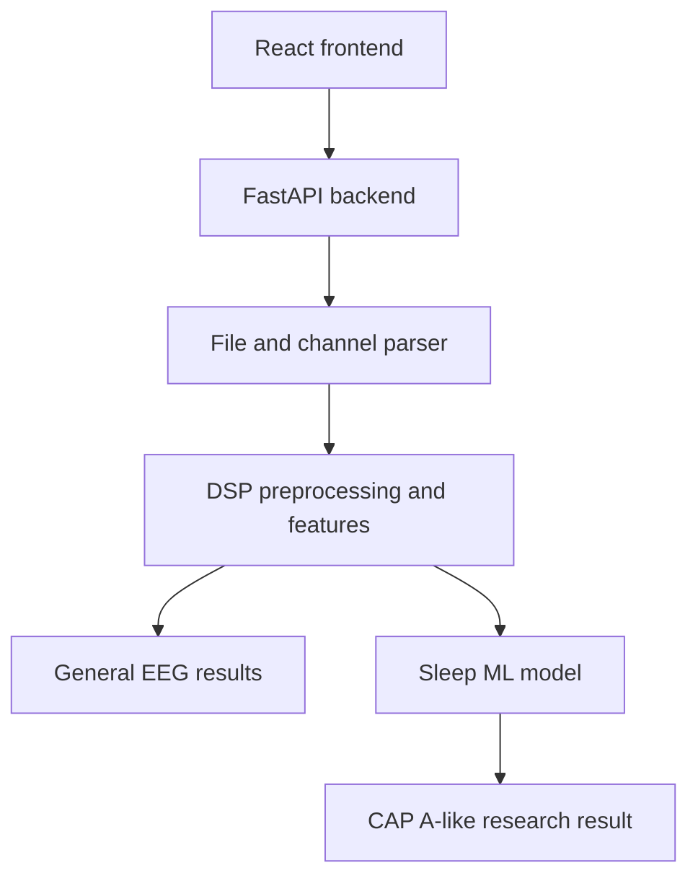

# NeuroViz

### Biomedical EEG Signal Processing, Visualization and Research ML Toolkit

NeuroViz is a full-stack application for uploading, cleaning, visualizing and analysing electroencephalogram (EEG) recordings. It combines a traditional digital signal processing (DSP) workflow with a separate machine-learning research module for analysing **CAP A-like patterns during NREM sleep**.

The project provides two different experiences:

- A **general EEG analysis system** for viewing raw and cleaned signals, calculating signal features, checking possible artifacts and performing alpha-power comparisons.
- A separate **Clinical Sleep Analysis** module that evaluates C4-A1 EEG activity inside expert-labelled N2 and N3 sleep epochs.

> **Important:** NeuroViz is an educational and research prototype. It does not diagnose insomnia, palsy, epilepsy, depression, anxiety or any other medical condition. Its results must not replace evaluation by a qualified medical professional.

---

## Table of Contents

1. [Project Overview](#project-overview)
2. [Why the Project Has Two Analysis Modes](#why-the-project-has-two-analysis-modes)
3. [Main Features](#main-features)
4. [System Architecture](#system-architecture)
5. [General EEG Analysis](#general-eeg-analysis)
6. [Clinical Sleep Analysis](#clinical-sleep-analysis)
7. [Machine-Learning Model](#machine-learning-model)
8. [Dataset and Training](#dataset-and-training)
9. [Model Evaluation](#model-evaluation)
10. [Technology Stack](#technology-stack)
11. [Project Structure](#project-structure)
12. [Installation](#installation)
13. [Running the Application](#running-the-application)
14. [How to Use NeuroViz](#how-to-use-neuroviz)
15. [API Endpoints](#api-endpoints)
16. [Testing](#testing)
17. [Deployment Notes](#deployment-notes)
18. [Limitations](#limitations)
19. [Future Scope](#future-scope)
20. [Troubleshooting](#troubleshooting)

---

## Project Overview

EEG signals are small electrical signals recorded from electrodes placed on the scalp. The signals can contain useful brain activity, but they can also contain unwanted components caused by:

- Eye blinking
- Facial or body movement
- Muscle activity
- Loose electrode contact
- Slow signal drift
- Electrical power-line interference
- Recording-device noise

NeuroViz helps a user inspect these recordings through a clear sequence:

1. Upload an EEG file.
2. Detect and map available EEG channels.
3. Display the original raw signal.
4. Reduce common unwanted noise.
5. Display the processed signal.
6. Calculate statistical and frequency-based measurements.
7. Check engineering indicators of possible artifacts.
8. Present technical and patient-friendly explanations.

The separate sleep module adds a machine-learning layer. It does not attempt to diagnose insomnia directly. Instead, it checks whether 30-second N2/N3 EEG segments resemble **CAP A-event examples** from a small research dataset.

---

## Why the Project Has Two Analysis Modes

The general EEG system and the sleep ML system use different recording requirements and should not be mixed.

| Mode | Main purpose | Typical channels | Required files |
|---|---|---|---|
| General EEG Analysis | Signal cleaning, visualization, features, artifacts and alpha comparison | T7, F8, F3, F4, Cz, P4 and other detected EEG channels | TXT, CSV or EDF depending on file structure |
| Clinical Sleep Analysis | Research detection of CAP A-like activity in N2 and N3 sleep | C4-A1 | A clinical EDF and its matching sleep-annotation TXT |

A model trained using C4-A1 clinical polysomnography data cannot automatically be applied to T7/F8 consumer-headset data. For this reason, the Clinical Sleep Analysis feature is kept as a separate tab.

---

## Main Features

### General EEG features

- TXT, CSV and EDF file handling
- Channel-name normalization
- Channel detection independent of column order
- Manual channel-mapping confirmation when automatic mapping is uncertain
- Raw signal visualization
- Cleaned signal visualization
- Multiple EEG channel support
- Consistent channel colours across graphs, buttons and the 3D sensor map
- Basic signal statistics
- Frequency-band measurements
- Dominant-frequency estimation
- Alpha-power comparison and FAA calculation when a supported pair exists
- Possible ocular and muscle artifact indicators
- Technical/clinician view
- Simplified patient view
- 3D electrode-location visualization

### Sleep research features

- Paired clinical EDF and annotation-TXT upload
- C4-A1 channel validation
- EDF/annotation clock alignment
- Expert sleep-stage parsing
- N2 and N3 epoch selection
- 30-second EEG preprocessing
- Forty engineered EEG features per epoch
- CAP A-like epoch scoring
- Separate N2 and N3 summaries
- Raw and cleaned C4-A1 previews
- Technical results view
- Simple explanation view
- Research and clinical-safety warnings

---

## System Architecture



### Frontend responsibilities

The React frontend:

- Accepts uploaded files.
- Sends files to the FastAPI backend.
- Shows upload and processing status.
- Displays raw and cleaned EEG graphs.
- Shows detected electrodes on a 3D brain model.
- Presents clinician-level technical information.
- Presents simple patient-facing explanations.
- Keeps the sleep research workflow separate from general EEG analysis.

### Backend responsibilities

The FastAPI backend:

- Reads TXT, CSV and EDF files.
- Detects and standardizes EEG channel names.
- Validates required channels.
- Cleans and normalizes the signals.
- Calculates EEG features.
- Checks artifact indicators.
- Calculates supported alpha comparisons.
- Parses sleep-stage and CAP annotations.
- Aligns EDF and annotation timelines.
- Loads the trained research model.
- Returns structured JSON results to the frontend.

---

## General EEG Analysis

### 1. File reading

The general analysis route accepts supported EEG recordings and identifies signal columns. Channel columns may appear in any order. NeuroViz uses label normalization and mapping logic instead of assuming fixed column positions.

For example, all of the following should be interpreted consistently when the labels are clear:

- `F3`, `F4`, `T7`, `F8`
- `EEG F3`, `EEG-F4`
- Referenced or bipolar EDF labels where supported

If the program cannot confidently decide which signal belongs to which EEG channel, it returns a mapping request so the user can confirm the channel assignment.

### 2. Raw signal

The raw graph shows the original values read from the uploaded recording. It can contain real EEG activity together with blinking, movement, electrode offsets, drift and electrical interference.

The raw graph is retained because it allows the original input to be inspected instead of hiding all preprocessing effects.

### 3. Signal cleaning

The current general pipeline applies operations such as:

- Band-pass filtering to retain the main EEG frequency range
- Optional 50 Hz notch filtering when appropriate
- Finite-value handling
- Z-score normalization for processed visualization and compatible feature calculation

Cleaning does not make an EEG line perfectly smooth. A real EEG signal remains irregular because brain activity changes rapidly. The purpose is to reduce common unwanted components while preserving useful signal variation.

### 4. Calculated measurements

Depending on channel availability, the backend calculates measurements such as:

- Mean
- Standard deviation
- Minimum value
- Maximum value
- Wavelet energy
- Dominant frequency
- Delta-band power
- Theta-band power
- Alpha-band power
- Sigma-band power
- Beta-band power

The processed statistics may use normalized units. Therefore, a cleaned mean near zero and standard deviation near one can be an expected result of Z-score normalization.

### 5. Artifact indicators

NeuroViz checks engineering indicators that may be consistent with ocular or muscle contamination. These flags help a user review suspicious parts of a recording, but they are not clinical diagnoses.

An artifact flag can be affected by:

- Eye movement
- Blinking
- Jaw or facial-muscle activity
- Electrode displacement
- Sudden movement
- Unusual recording conditions

### 6. Alpha comparison and FAA

Frontal Alpha Asymmetry (FAA) compares alpha-band power between supported left and right channels.

The preferred standard frontal pair is:

- Left: F3
- Right: F4

If F3 and F4 are unavailable, the original project may retain a fallback comparison for compatibility. A fallback T7/F8-style comparison is clearly labelled **experimental** and must not be presented as standard frontal FAA.

FAA in NeuroViz is an exploratory mathematical EEG feature. It must not be interpreted as a direct measurement of:

- Happiness
- Stress
- Depression
- Focus
- Emotional health
- General wellness

The patient view therefore describes FAA as a side-to-side alpha comparison rather than a positive or negative health result.

### 7. Clinician and patient views

The clinician view includes detailed graphs, measurements, channel information, artifact indicators and feature values.

The patient view uses simpler language and explains:

- What the uploaded signal represents
- What raw and cleaned graphs mean
- Why a cleaned EEG can still look irregular
- What the electrode colours mean
- What the measurements cannot diagnose

---

## Clinical Sleep Analysis

The Clinical Sleep Analysis tab is a separate research workflow designed around recordings from the PhysioNet CAP Sleep Database.

### Required inputs

The user must upload two matching files:

1. A clinical `.edf` recording containing C4-A1.
2. Its matching `.txt` sleep annotation file.

### Why both files are needed

The EDF file provides:

- The actual EEG waveform
- Channel labels
- Sampling frequencies
- Recording start time
- Recording duration

The TXT annotation provides:

- Expert-labelled sleep stages
- N2 and N3 epoch locations
- CAP event timings
- Annotation start time

The model does **not** determine the sleep stage. The annotation file tells the system which 30-second periods are N2 and which are N3. The model then evaluates those selected EEG periods for CAP A-like activity.

### Timeline alignment

Some CAP recordings have different EDF and annotation start times. NeuroViz calculates the time difference and applies an offset before selecting epochs.

This alignment step prevents the system from accidentally extracting EEG from the wrong clock position.

### Sleep preprocessing

Each selected 30-second C4-A1 segment is processed using a consistent pipeline:

1. Extract the aligned C4-A1 epoch.
2. Remove the local linear trend.
3. Apply a 0.5–35 Hz band-pass filter.
4. Apply a 50 Hz notch filter when valid.
5. Resample to 128 Hz.
6. Produce 3,840 samples per 30-second epoch.
7. Check for empty, non-finite, near-flat or extreme signals.
8. Create a normalized copy where required.
9. Extract the forty model features.

### What the sleep result means

For every selected N2/N3 segment, the model returns a score between zero and one. A threshold of 0.50 converts that score into one of two research labels:

- CAP A-like pattern not flagged
- CAP A-like pattern flagged

CAP A phases are brief activations associated with the organization and instability of NREM sleep. They can also occur during normal sleep. Therefore, a CAP A-like flag is not automatically abnormal and does not prove that a person has insomnia.

The application reports:

- Mean model score
- Number of evaluated epochs
- Number of rejected epochs
- Fraction of sampled epochs flagged as CAP A-like
- N2-specific result
- N3-specific result

The reported fraction is not an official clinical CAP rate because official CAP scoring requires additional sequence and timing rules.

---

## Machine-Learning Model

### Final model name

The deployed research model is best described as:

> **A single-channel, feature-based CAP A-like EEG epoch classifier**

### Model type

The model is a supervised binary-classification pipeline containing:

1. `StandardScaler`
2. `LogisticRegression`

The scaler places the engineered features on comparable numerical scales. Logistic regression then calculates a CAP A-like score from the feature combination.

### What the model predicts

The model predicts whether a 30-second C4-A1 segment from an already-labelled N2 or N3 period resembles epochs that contained an expert-annotated CAP A-event.

It does not directly predict:

- Insomnia
- Palsy
- Sleep quality
- Wake, N1, N2, N3 or REM stage
- An official CAP rate
- A medical diagnosis

### Why logistic regression was selected

Logistic regression was selected because it:

- Performed better than the tested Random Forest on the main held-out metrics.
- Is lightweight and fast during inference.
- Is easier to explain in a viva.
- Produces interpretable feature coefficients.
- Works well with engineered numerical features.
- Is simpler to deploy with FastAPI.

### Forty model features

The model uses forty engineered features from each epoch.

#### Time-domain features

- Mean
- Standard deviation
- Variance
- Root mean square
- Minimum
- Maximum
- Peak-to-peak amplitude
- Skewness
- Kurtosis
- Line length
- Mean absolute difference
- Zero-crossing rate
- Hjorth activity
- Hjorth mobility
- Hjorth complexity

#### Frequency-domain features

- Total power
- Log total power
- Absolute delta power
- Log delta power
- Relative delta power
- Absolute theta power
- Log theta power
- Relative theta power
- Absolute alpha power
- Log alpha power
- Relative alpha power
- Absolute sigma power
- Log sigma power
- Relative sigma power
- Absolute beta power
- Log beta power
- Relative beta power
- Dominant frequency
- Median frequency
- Spectral-edge frequency at 95%
- Spectral entropy
- Theta/alpha ratio
- Beta/alpha ratio
- Delta/beta ratio
- Sigma/total-power ratio

---

## Dataset and Training

### Data source

The sleep research work uses the **PhysioNet CAP Sleep Database version 1.0.0**:

https://physionet.org/content/capslpdb/1.0.0/

The complete database is large, so a small deliberate pilot subset was used during development.

### Independent subjects used

Six recordings from six independent people were used:

| Diagnosis metadata | Subjects |
|---|---|
| Normal | n1, n2, n3 |
| Insomnia | ins1, ins2, ins3 |

The diagnosis field was retained as metadata, but the final CAP model target was not insomnia. The target was whether an N2/N3 epoch overlapped an expert CAP A-event.

### Why C4-A1 was selected

C4-A1 was selected because it was available across all six chosen recordings. Using one common channel made it possible to build a consistent pilot pipeline without pretending that missing channel arrangements were equivalent.

### Training labels

A 30-second N2/N3 epoch received:

- Label `1` when it overlapped an expert MCAP-A1, MCAP-A2 or MCAP-A3 event.
- Label `0` when no such CAP A-event overlapped the epoch.

The classifier does not separately predict A1, A2 and A3 subtypes.

### Balanced training set

For each subject, the training pipeline selected:

- 40 CAP-positive N2 epochs
- 40 CAP-negative N2 epochs
- 40 CAP-positive N3 epochs
- 40 CAP-negative N3 epochs

This produced:

- 160 epochs per subject
- 6 independent subjects
- 960 total epochs
- 480 positive epochs
- 480 negative epochs

Balancing prevents the model from achieving misleading accuracy by predicting only the majority class.

### Preventing subject leakage

Epochs from the same person are similar. Randomly placing epochs from one person in both training and validation would create unrealistically high performance.

The final pilot evaluation therefore used **Leave-One-Group-Out validation by subject**:

1. Train on five people.
2. Validate on the sixth person.
3. Repeat until every person has been the held-out validation subject.

This keeps each person's epochs entirely on one side of a validation fold.

---

## Model Evaluation

### Logistic Regression

| Metric | Held-out result |
|---|---:|
| Accuracy | 63.23% |
| Balanced accuracy | 63.23% |
| Precision | 63.66% |
| Recall | 61.67% |
| F1 score | 62.65% |
| Pooled ROC-AUC | 65.29% |
| Mean subject ROC-AUC | 69.97% |

Confusion matrix:

```text
[[311, 169],
 [184, 296]]
```

### Performance by stage

| Sleep stage | Accuracy | ROC-AUC |
|---|---:|---:|
| N2 | 66.46% | 68.41% |
| N3 | 60.00% | 62.00% |

### Random Forest comparison

| Metric | Random Forest result |
|---|---:|
| Accuracy | 60.63% |
| Pooled ROC-AUC | 61.72% |
| Mean subject ROC-AUC | 64.10% |

Logistic regression was retained because its main held-out results were better and it was more interpretable.

### Honest interpretation

The results demonstrate that the pipeline learns some signal related to CAP A-event presence. However, the performance is modest and only six independent people were available. The saved model is therefore a **research prototype**, not a clinically validated model.

### Example inference

An example run on `ins1.edf` evaluated 120 evenly selected N2/N3 epochs:

- Evaluated epochs: 120
- Quality rejections: 0
- Mean CAP A-like score: 0.4194
- Flagged epoch fraction: 30.0%
- N2: 31 of 95 epochs flagged, or 32.6%
- N3: 5 of 25 epochs flagged, or 20.0%

This means the model found more CAP A-like patterns in the sampled N2 epochs than in the sampled N3 epochs. It does not prove or rule out insomnia.

---

## Technology Stack

### Frontend

- React
- JavaScript
- Bootstrap
- Recharts
- Three.js
- React Three Fiber
- Drei
- Lucide React icons
- Axios

### Backend and signal processing

- Python
- FastAPI
- Uvicorn
- NumPy
- Pandas
- SciPy
- MNE
- PyWavelets
- Python Multipart

### Machine learning

- scikit-learn
- joblib
- StandardScaler
- Logistic Regression
- Random Forest for model comparison

---

## Project Structure

```text
NeuroViz_Minor_Project/
├── backend/
│   ├── main.py
│   ├── channel_mapping.py
│   ├── dsp_features.py
│   ├── eeg_channels.py
│   ├── faa_metadata.py
│   ├── cap_inference.py
│   ├── sleep_annotations.py
│   ├── sleep_features.py
│   ├── sleep_preprocessing.py
│   ├── test_channel_mapping.py
│   ├── test_dsp_features.py
│   ├── test_faa_metadata.py
│   └── requirements.txt
├── frontend/
│   ├── public/
│   │   └── models/
│   │       └── brain.glb
│   └── src/
│       ├── App.js
│       ├── App.css
│       └── components/
│           ├── ArtifactDetector.js
│           ├── BrainModel.js
│           ├── Dashboard.js
│           ├── PatientView.js
│           ├── RawSignalView.js
│           ├── SensorMap.js
│           ├── Settings.js
│           ├── Sidebar.js
│           ├── SleepAnalysis.js
│           ├── TestResultSummary.js
│           ├── TestResults.js
│           └── eegData.js
├── ml/
│   ├── artifacts/
│   │   ├── cap_feature_schema.json
│   │   ├── cap_research_model.joblib
│   │   └── cap_research_model_metadata.json
│   ├── extract_cap_features.py
│   ├── extract_features.py
│   ├── extract_nrem_features.py
│   ├── inspect_annotations.py
│   ├── inspect_cap_epochs.py
│   ├── inspect_channels.py
│   ├── train_cap_pilot.py
│   ├── train_cap_research_model.py
│   ├── train_nrem_pilot.py
│   └── train_pilot.py
├── requirements.txt
├── .gitignore
└── README.md
```

Large EDF recordings, raw datasets, generated feature CSV files, environment files, cache files and `node_modules` are intentionally excluded from Git.

---

## Installation

### Prerequisites

Install:

- Python 3.10 or newer
- Node.js 18 or newer
- npm
- Git

### Clone the repository

```bash
git clone https://github.com/Samridhi024/NeuroViz_Minor_Project.git
cd NeuroViz_Minor_Project
```

### Create a Python environment

Windows PowerShell:

```powershell
python -m venv .venv
.\.venv\Scripts\Activate.ps1
```

If PowerShell blocks activation, use Anaconda or run Python from the environment of your choice.

### Install backend dependencies

From the project root:

```powershell
pip install -r requirements.txt
```

If the root file is unavailable, use:

```powershell
pip install -r backend\requirements.txt
```

### Install frontend dependencies

```powershell
cd frontend
npm install
cd ..
```

---

## Running the Application

Open two terminals.

### Terminal 1: backend

Run this command from the project root:

```powershell
python -m uvicorn backend.main:app --reload --host 127.0.0.1 --port 8000
```

The API will run at:

```text
http://127.0.0.1:8000
```

Interactive API documentation is available at:

```text
http://127.0.0.1:8000/docs
```

### Terminal 2: frontend

```powershell
cd frontend
npm start
```

The React application will normally open at:

```text
http://localhost:3000
```

### Optional frontend environment file

Create `frontend/.env` when the backend is hosted at a different URL:

```env
REACT_APP_API_BASE_URL=http://127.0.0.1:8000
```

Environment files should not be committed to Git.

---

## How to Use NeuroViz

### General EEG workflow

1. Open the Dashboard.
2. Select a supported EEG file.
3. Confirm channel mappings if the program requests confirmation.
4. Click the analysis button.
5. Review the raw signal and possible artifacts.
6. Switch to the cleaned-signal view.
7. Review the processed graph and calculated features.
8. Switch between clinician and patient views when required.
9. Open Test Results for detailed channel measurements.

### Clinical sleep workflow

1. Open **Sleep Analysis** from the sidebar.
2. Select a clinical EDF containing C4-A1.
3. Select the matching CAP-style TXT annotation.
4. Choose the maximum number of evenly distributed epochs.
5. Click **Run Sleep Analysis**.
6. Review the numerical result cards.
7. Use **Technical Results** for stage tables, alignment and signal details.
8. Use **Simple Explanation** for patient-friendly wording.

If either file is missing, the sleep-analysis button remains disabled because the signal and expert stage timings are both required.

---

## API Endpoints

### General analysis

```http
POST /analyze
```

Accepts a supported EEG file and optional confirmed channel mapping. Returns raw/clean graph data, features, channel details, FAA metadata and artifact information.

### Clinical sleep analysis

```http
POST /analyze-sleep
```

Expected multipart fields:

- `edf_file`
- `annotation_file`
- `max_epochs`
- `include_epoch_predictions`

Returns recording information, alignment details, overall CAP A-like summary, N2/N3 results, signal previews, model metadata and limitations.

---

## Testing

Run the available backend checks from the project root:

```powershell
python backend\test_channel_mapping.py
python backend\test_dsp_features.py
python backend\test_faa_metadata.py
```

Useful research-pipeline inspection commands include:

```powershell
python ml\inspect_channels.py
python ml\inspect_annotations.py
python ml\inspect_cap_epochs.py
```

Run frontend checks with:

```powershell
cd frontend
npm test
```

Create a production frontend build with:

```powershell
npm run build
```

---

## Deployment Notes

### Files required by the backend

The deployed backend must include:

- Backend Python modules
- `ml/artifacts/cap_research_model.joblib`
- `ml/artifacts/cap_research_model_metadata.json`
- `ml/artifacts/cap_feature_schema.json`
- Python dependencies

The large training EDF files and generated feature CSV files are not required for normal inference.

### Production considerations

- Configure the frontend API URL through `REACT_APP_API_BASE_URL`.
- Configure FastAPI CORS for the deployed frontend domain.
- Use temporary storage for uploaded EDF files.
- Delete temporary uploads after analysis.
- Apply upload-size limits.
- Expect clinical EDF files to be large.
- Configure longer server timeouts for large uploads.
- Do not commit secrets or environment files.
- Do not log patient-identifying information.
- Display the research-only disclaimer on every sleep result.

---

## Limitations

### General EEG limitations

- Signal quality depends on electrode placement and recording equipment.
- Consumer EEG channels cannot replace clinical polysomnography.
- Normalization changes the numerical scale of the processed graph.
- Artifact rules are engineering indicators, not expert diagnoses.
- Fallback alpha pairs are not equivalent to standard F3/F4 FAA.
- FAA cannot independently identify mood, stress or disease.

### Sleep-model limitations

- Only six independent subjects were used.
- The pilot subjects are not sufficiently age matched.
- Normal subjects in the chosen subset were younger than the insomnia subjects, creating a possible age confound.
- Only C4-A1 was used by the model.
- Only N2 and N3 expert-labelled epochs are evaluated.
- Sleep stages are supplied by the TXT annotation and are not predicted.
- The model has not been externally validated.
- The score is not calibrated as a clinical probability.
- The predicted fraction is not an official CAP rate.
- The decision threshold is a research threshold.
- Performance is not high enough for clinical deployment.
- Results cannot confirm or rule out insomnia.

---

## Future Scope

Possible future improvements include:

1. Add more independent normal and insomnia subjects.
2. Match subject groups by age and sex.
3. Keep a completely untouched external test cohort.
4. Validate the model on a second sleep database.
5. Add multi-channel sleep features.
6. Evaluate central, frontal and occipital EEG combinations.
7. Train a separate sleep-stage classifier.
8. Add N1 and REM analysis when scientifically justified.
9. Model temporal CAP sequences instead of independent epochs only.
10. Implement official CAP A/B sequence rules.
11. Calibrate model scores using a larger validation cohort.
12. Add model-version tracking.
13. Add explainable feature-contribution displays.
14. Add secure clinical data storage and access control.
15. Perform prospective testing with expert sleep scorers.

An insomnia-related model should only be reconsidered after obtaining more independent subjects, controlling confounders and defining clinically meaningful whole-night features.

---

## Troubleshooting

### Backend root shows `404 Not Found`

This does not necessarily mean the backend is broken. The application mainly uses POST analysis endpoints. Open `/docs` or send a valid request from the frontend.

### CORS error in the browser

Confirm that:

- FastAPI CORS middleware allows `http://localhost:3000` during development.
- The frontend API URL points to the correct backend.
- The backend is running on port 8000.

### `No module named ...`

Run Uvicorn from the project root:

```powershell
python -m uvicorn backend.main:app --reload
```

Also confirm that the required Python dependencies are installed in the active environment.

### `numpy has no attribute trapezoid`

Some NumPy versions do not provide `numpy.trapezoid`. The project includes compatibility handling so numerical integration can fall back to `numpy.trapz` where required.

### Brain model cannot be loaded

Confirm that the model exists at:

```text
frontend/public/models/brain.glb
```

The React application loads public assets using `/models/brain.glb`.

### Sleep-analysis button cannot be clicked

Both the EDF and the matching TXT annotation must be selected. The EDF must contain the required C4-A1 channel.

### Cleaned graph still looks irregular

This is expected. Filtering removes selected unwanted components but does not make a real EEG signal flat. Also check the vertical scale: raw and normalized graphs can use very different ranges.

### Git rejects a large EDF file

Raw EDF data should remain outside Git. The project `.gitignore` excludes the local data directory and EDF files.

---

## Research and Ethical Use

NeuroViz should be used for:

- Education
- Demonstration of EEG processing
- Reproducible signal-analysis experiments
- Research prototyping
- Learning full-stack biomedical application development

NeuroViz should not be used for:

- Self-diagnosis
- Clinical decision-making
- Emergency assessment
- Treatment selection
- Replacing a neurologist or sleep specialist

When using real recordings, remove patient-identifying information and follow the applicable institutional, ethical and privacy requirements.

---

## Summary

NeuroViz demonstrates an end-to-end biomedical engineering workflow:

- Robust file and channel handling
- EEG preprocessing
- Raw and cleaned visualization
- Signal-feature extraction
- Artifact indicators
- Alpha-power comparison
- 3D electrode visualization
- Patient-friendly reporting
- Clinical EDF and annotation alignment
- Sleep-epoch feature engineering
- Leakage-aware model evaluation
- FastAPI model serving
- React-based result presentation

The project's strongest contribution is not a medical diagnosis. It is the integration of signal processing, transparent machine learning, safe interpretation and an understandable user interface in one complete application.

